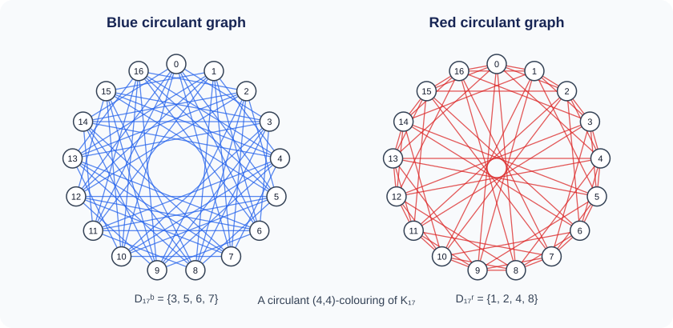

# Ramsey Number Lower Bounds

> Accompanying computational material for the paper *An Integer Programming Approach to Compute Lower Bounds for Ramsey Numbers Using Circulant Graphs*.

Paper authors: Stefano Coniglio, Fabio Furini, Ivana Ljubić, Pablo San Segundo, Johannes Thürauf, and Emiliano Traversi.

This repository provides the computational material needed to rerun the mathematical models developed in the paper. The executable package can be used to search for new lower bounds on Ramsey numbers and to compute circulant Ramsey numbers. The repository also provides an independent checker for verifying whether a given graph certificate is an (m,n)-coloring, together with the certificates and visual material supporting the results reported in the paper.

<p align="center">
  
</p>

<p align="center"><em>A circulant (4,4)-colouring of K<sub>17</sub>. The two complementary colour classes both avoid a clique of order 4.</em></p>

## Contents

| Directory | What it contains |
| --- | --- |
| [`code/`](code/README.md) | The executable package for rerunning the paper's models to search for new lower bounds or compute circulant Ramsey numbers, with complete instructions and input/output documentation. |
| [`checker/`](checker/README.md) | The independent checker for deciding whether a graph certificate is an (m,n)-coloring. |
| [`lower-bounds/`](lower-bounds/README.md) | Graph certificates and browser-renderable coloured circular-distance matrices. |
| [`circulant-engine/`](circulant-engine/README.md) | An independent reimplementation of **genCyc**, the circulant generator of Goedgebeur and Van Overberghe (credited there): a standalone exhaustive search over circular-distance orbits, without an LP, generic in the graph order, used as a second engine and as a cross-check of the branch-and-cut. |

## Start here

1. **Rerun the paper's models.** Follow [`code/README.md`](code/README.md) to search for new lower bounds or compute circulant Ramsey numbers. The page documents the available models, their parameters, installation instructions, and input/output files.
2. **Verify a certificate independently.** Use the stand-alone checker in [`checker/`](checker/README.md). It decides whether a given graph and its complement avoid the two forbidden clique sizes and therefore form an (m,n)-coloring. It does not require CPLEX or the solver.
3. **Inspect the lower bounds reported in the paper.** Open [`lower-bounds/README.md`](lower-bounds/README.md) for an overview, then [`lower-bounds/ramsey-number-lower-bounds.md`](lower-bounds/ramsey-number-lower-bounds.md) for the new Ramsey number lower bounds or [`lower-bounds/circulant-ramsey-numbers.md`](lower-bounds/circulant-ramsey-numbers.md) for the lower-bound certificates underlying the circulant Ramsey numbers, together with their graph certificates and coloured visualisations.

## What the solver searches for

The solver requires a local installation of IBM ILOG CPLEX. It searches for an (m,n)-coloring of the complete graph K<sub>t</sub>: a partition of all its edges into a blue graph containing no clique of size m and a red graph containing no clique of size n. Finding such a coloring on t vertices proves the lower bound R(m,n) ≥ t+1.

The executable package implements the mathematical models and algorithms developed in the paper. The CPLEX setup, available models, parameters, execution commands, and generated output files are documented in [`code/README.md`](code/README.md).

The large-scale computational campaign reported in the paper used CPLEX 22.1.0.0. The supplied precompiled solver package currently targets CPLEX Studio 20.1 for linking and execution; its specific requirements are documented in [`code/INSTALL.md`](code/INSTALL.md).

## Repository layout

```text
ramsey-number-lower-bounds/
├── checker/                    # independent (m,n)-coloring checker
├── code/
│   ├── solver/                 # executable package for the paper's models
│   ├── source/                 # solver source, for inspection
│   └── NEW-OPTIONS.md          # optional search additions, off by default
├── circulant-engine/
│   └── source/                 # genCyc reimplementation: exhaustive search over distance orbits
├── lower-bounds/
│   ├── certificates/           # graph certificates
│   ├── matrices/               # coloured PNG distance matrices
│   ├── tools/                  # renderers for the matrix figures
│   ├── ramsey-number-lower-bounds.md  # new lower bounds on R(3,n)
│   └── circulant-ramsey-numbers.md    # circulant Ramsey number lower-bound certificates
└── README.md
```

## License

This repository uses two licenses:

- The software in [`code/`](code/), [`checker/`](checker/), and the repository's Python rendering tools is licensed under the [GNU General Public License v3.0 or later](LICENSE). The compiled solver and checker incorporate [BitGraph](https://github.com/psanse/BitGraph) and coptBG components by Pablo San Segundo (CSIC-UPM).
- The graph certificates, coloured matrices, figures, and accompanying documentation in [`lower-bounds/`](lower-bounds/) are licensed under [CC BY-NC-SA 4.0](lower-bounds/LICENSE), which permits sharing and adaptation for non-commercial purposes with attribution and under the same license.

See [`NOTICE.md`](NOTICE.md) for the exact path-by-path scope, copyright attribution, third-party components, and written permission associated with the precompiled binaries.

## Citation request

If this repository, its code, or its lower-bound certificates contribute to a scientific publication, please cite the accompanying paper, *An Integer Programming Approach to Compute Lower Bounds for Ramsey Numbers Using Circulant Graphs*, and identify the repository commit used for the computation. This citation request does not restrict the permissions granted by the licenses above.

## BibTeX

```bibtex
@misc{coniglio_ramsey_lower_bounds,
  author = {Coniglio, Stefano and Furini, Fabio and Ljubi{\'c}, Ivana and
            San Segundo, Pablo and Th{\"u}rauf, Johannes and Traversi, Emiliano},
  title  = {An Integer Programming Approach to Compute Lower Bounds for
            Ramsey Numbers Using Circulant Graphs},
  year   = {2026},
  url    = {https://github.com/fabiofurini/ramsey-number-lower-bounds}
}
```
