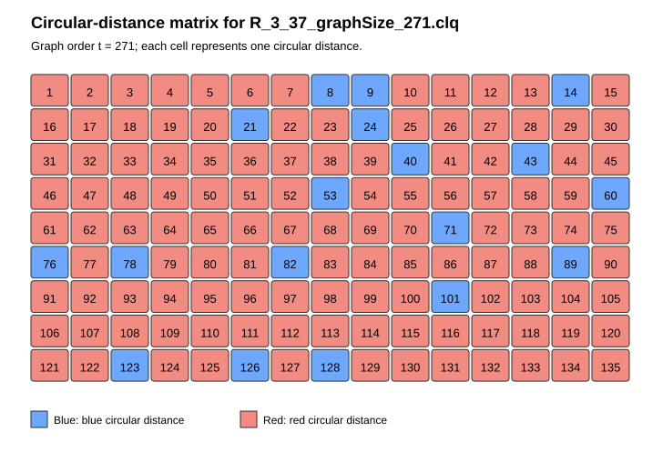

# Lower bounds

This directory contains the lower-bound certificates computed for the paper's Ramsey instances, together with their coloured visualisations and the tools used to render them.

Each certificate is a `.clq` file named `R_<m>_<n>_graphSize_<N>.clq`, representing the red colour class of a two-edge-colouring of a complete graph on `N` vertices; the blue colour class is its complement. This follows the paper's convention: for $R(m,n)$, the blue graph avoids $K_m$ and the red graph avoids $K_n$.

Every certificate has two companion figures with the same basename: `<certificate>.svg` (circular-distance matrix) and `<certificate>_adjacency.svg` (full adjacency matrix). Renderers for both are in [`tools/`](tools/).

The certificates, matrices, and documentation in this directory are licensed under [CC BY-NC-SA 4.0](LICENSE). The Python rendering scripts in [`tools/`](tools/) are software and are instead licensed under GPL-3.0-or-later; see [`../NOTICE.md`](../NOTICE.md).

## Certificates

Click a filename to open the certificate, or a figure link to open its circular-distance / adjacency matrix.

### R(3,n)

| Instance | N | Certificate | Figures |
| --- | --- | --- | --- |
| R(3,7) | 21 | [R_3_7_graphSize_21.clq](certificates/R_3_7_graphSize_21.clq) | [distances](matrices/R_3_7_graphSize_21.svg) · [adjacency](matrices/R_3_7_graphSize_21_adjacency.svg) |
| R(3,8) | 26 | [R_3_8_graphSize_26.clq](certificates/R_3_8_graphSize_26.clq) | [distances](matrices/R_3_8_graphSize_26.svg) · [adjacency](matrices/R_3_8_graphSize_26_adjacency.svg) |
| R(3,9) | 35 | [R_3_9_graphSize_35.clq](certificates/R_3_9_graphSize_35.clq) | [distances](matrices/R_3_9_graphSize_35.svg) · [adjacency](matrices/R_3_9_graphSize_35_adjacency.svg) |
| R(3,10) | 38 | [R_3_10_graphSize_38.clq](certificates/R_3_10_graphSize_38.clq) | [distances](matrices/R_3_10_graphSize_38.svg) · [adjacency](matrices/R_3_10_graphSize_38_adjacency.svg) |
| R(3,11) | 45 | [R_3_11_graphSize_45.clq](certificates/R_3_11_graphSize_45.clq) | [distances](matrices/R_3_11_graphSize_45.svg) · [adjacency](matrices/R_3_11_graphSize_45_adjacency.svg) |
| R(3,12) | 48 | [R_3_12_graphSize_48.clq](certificates/R_3_12_graphSize_48.clq) | [distances](matrices/R_3_12_graphSize_48.svg) · [adjacency](matrices/R_3_12_graphSize_48_adjacency.svg) |
| R(3,13) | 57 | [R_3_13_graphSize_57.clq](certificates/R_3_13_graphSize_57.clq) | [distances](matrices/R_3_13_graphSize_57.svg) · [adjacency](matrices/R_3_13_graphSize_57_adjacency.svg) |
| R(3,14) | 63 | [R_3_14_graphSize_63.clq](certificates/R_3_14_graphSize_63.clq) | [distances](matrices/R_3_14_graphSize_63.svg) · [adjacency](matrices/R_3_14_graphSize_63_adjacency.svg) |
| R(3,15) | 72 | [R_3_15_graphSize_72.clq](certificates/R_3_15_graphSize_72.clq) | [distances](matrices/R_3_15_graphSize_72.svg) · [adjacency](matrices/R_3_15_graphSize_72_adjacency.svg) |
| R(3,16) | 78 | [R_3_16_graphSize_78.clq](certificates/R_3_16_graphSize_78.clq) | [distances](matrices/R_3_16_graphSize_78.svg) · [adjacency](matrices/R_3_16_graphSize_78_adjacency.svg) |
| R(3,17) | 91 | [R_3_17_graphSize_91.clq](certificates/R_3_17_graphSize_91.clq) | [distances](matrices/R_3_17_graphSize_91.svg) · [adjacency](matrices/R_3_17_graphSize_91_adjacency.svg) |
| R(3,18) | 97 | [R_3_18_graphSize_97.clq](certificates/R_3_18_graphSize_97.clq) | [distances](matrices/R_3_18_graphSize_97.svg) · [adjacency](matrices/R_3_18_graphSize_97_adjacency.svg) |
| R(3,19) | 105 | [R_3_19_graphSize_105.clq](certificates/R_3_19_graphSize_105.clq) | [distances](matrices/R_3_19_graphSize_105.svg) · [adjacency](matrices/R_3_19_graphSize_105_adjacency.svg) |
| R(3,20) | 110 | [R_3_20_graphSize_110.clq](certificates/R_3_20_graphSize_110.clq) | [distances](matrices/R_3_20_graphSize_110.svg) · [adjacency](matrices/R_3_20_graphSize_110_adjacency.svg) |
| R(3,24) | 150 | [R_3_24_graphSize_150.clq](certificates/R_3_24_graphSize_150.clq) | [distances](matrices/R_3_24_graphSize_150.svg) · [adjacency](matrices/R_3_24_graphSize_150_adjacency.svg) |
| R(3,25) | 159 | [R_3_25_graphSize_159.clq](certificates/R_3_25_graphSize_159.clq) | [distances](matrices/R_3_25_graphSize_159.svg) · [adjacency](matrices/R_3_25_graphSize_159_adjacency.svg) |
| R(3,26) | 162 | [R_3_26_graphSize_162.clq](certificates/R_3_26_graphSize_162.clq) | [distances](matrices/R_3_26_graphSize_162.svg) · [adjacency](matrices/R_3_26_graphSize_162_adjacency.svg) |
| R(3,28) | 180 | [R_3_28_graphSize_180.clq](certificates/R_3_28_graphSize_180.clq) | [distances](matrices/R_3_28_graphSize_180.svg) · [adjacency](matrices/R_3_28_graphSize_180_adjacency.svg) |
| R(3,29) | 193 | [R_3_29_graphSize_193.clq](certificates/R_3_29_graphSize_193.clq) | [distances](matrices/R_3_29_graphSize_193.svg) · [adjacency](matrices/R_3_29_graphSize_193_adjacency.svg) |
| R(3,30) | 198 | [R_3_30_graphSize_198.clq](certificates/R_3_30_graphSize_198.clq) | [distances](matrices/R_3_30_graphSize_198.svg) · [adjacency](matrices/R_3_30_graphSize_198_adjacency.svg) |
| R(3,31) | 209 | [R_3_31_graphSize_209.clq](certificates/R_3_31_graphSize_209.clq) | [distances](matrices/R_3_31_graphSize_209.svg) · [adjacency](matrices/R_3_31_graphSize_209_adjacency.svg) |
| R(3,32) | 218 | [R_3_32_graphSize_218.clq](certificates/R_3_32_graphSize_218.clq) | [distances](matrices/R_3_32_graphSize_218.svg) · [adjacency](matrices/R_3_32_graphSize_218_adjacency.svg) |
| R(3,33) | 229 | [R_3_33_graphSize_229.clq](certificates/R_3_33_graphSize_229.clq) | [distances](matrices/R_3_33_graphSize_229.svg) · [adjacency](matrices/R_3_33_graphSize_229_adjacency.svg) |
| R(3,34) | 238 | [R_3_34_graphSize_238.clq](certificates/R_3_34_graphSize_238.clq) | [distances](matrices/R_3_34_graphSize_238.svg) · [adjacency](matrices/R_3_34_graphSize_238_adjacency.svg) |
| R(3,35) | 252 | [R_3_35_graphSize_252.clq](certificates/R_3_35_graphSize_252.clq) | [distances](matrices/R_3_35_graphSize_252.svg) · [adjacency](matrices/R_3_35_graphSize_252_adjacency.svg) |
| R(3,36) | 260 | [R_3_36_graphSize_260.clq](certificates/R_3_36_graphSize_260.clq) | [distances](matrices/R_3_36_graphSize_260.svg) · [adjacency](matrices/R_3_36_graphSize_260_adjacency.svg) |
| R(3,37) | 253 | [R_3_37_graphSize_253.clq](certificates/R_3_37_graphSize_253.clq) | [distances](matrices/R_3_37_graphSize_253.svg) · [adjacency](matrices/R_3_37_graphSize_253_adjacency.svg) |
| R(3,37) | 271 | [R_3_37_graphSize_271.clq](certificates/R_3_37_graphSize_271.clq) | [distances](matrices/R_3_37_graphSize_271.svg) · [adjacency](matrices/R_3_37_graphSize_271_adjacency.svg) |
| R(3,38) | 280 | [R_3_38_graphSize_280.clq](certificates/R_3_38_graphSize_280.clq) | [distances](matrices/R_3_38_graphSize_280.svg) · [adjacency](matrices/R_3_38_graphSize_280_adjacency.svg) |
| R(3,39) | 293 | [R_3_39_graphSize_293.clq](certificates/R_3_39_graphSize_293.clq) | [distances](matrices/R_3_39_graphSize_293.svg) · [adjacency](matrices/R_3_39_graphSize_293_adjacency.svg) |
| R(3,40) | 304 | [R_3_40_graphSize_304.clq](certificates/R_3_40_graphSize_304.clq) | [distances](matrices/R_3_40_graphSize_304.svg) · [adjacency](matrices/R_3_40_graphSize_304_adjacency.svg) |
| R(3,41) | 316 | [R_3_41_graphSize_316.clq](certificates/R_3_41_graphSize_316.clq) | [distances](matrices/R_3_41_graphSize_316.svg) · [adjacency](matrices/R_3_41_graphSize_316_adjacency.svg) |
| R(3,42) | 326 | [R_3_42_graphSize_326.clq](certificates/R_3_42_graphSize_326.clq) | [distances](matrices/R_3_42_graphSize_326.svg) · [adjacency](matrices/R_3_42_graphSize_326_adjacency.svg) |
| R(3,43) | 339 | [R_3_43_graphSize_339.clq](certificates/R_3_43_graphSize_339.clq) | [distances](matrices/R_3_43_graphSize_339.svg) · [adjacency](matrices/R_3_43_graphSize_339_adjacency.svg) |
| R(3,44) | 347 | [R_3_44_graphSize_347.clq](certificates/R_3_44_graphSize_347.clq) | [distances](matrices/R_3_44_graphSize_347.svg) · [adjacency](matrices/R_3_44_graphSize_347_adjacency.svg) |
| R(3,45) | 363 | [R_3_45_graphSize_363.clq](certificates/R_3_45_graphSize_363.clq) | [distances](matrices/R_3_45_graphSize_363.svg) · [adjacency](matrices/R_3_45_graphSize_363_adjacency.svg) |
| R(3,46) | 370 | [R_3_46_graphSize_370.clq](certificates/R_3_46_graphSize_370.clq) | [distances](matrices/R_3_46_graphSize_370.svg) · [adjacency](matrices/R_3_46_graphSize_370_adjacency.svg) |
| R(3,47) | 384 | [R_3_47_graphSize_384.clq](certificates/R_3_47_graphSize_384.clq) | [distances](matrices/R_3_47_graphSize_384.svg) · [adjacency](matrices/R_3_47_graphSize_384_adjacency.svg) |
| R(3,48) | 390 | [R_3_48_graphSize_390.clq](certificates/R_3_48_graphSize_390.clq) | [distances](matrices/R_3_48_graphSize_390.svg) · [adjacency](matrices/R_3_48_graphSize_390_adjacency.svg) |
| R(3,49) | 410 | [R_3_49_graphSize_410.clq](certificates/R_3_49_graphSize_410.clq) | [distances](matrices/R_3_49_graphSize_410.svg) · [adjacency](matrices/R_3_49_graphSize_410_adjacency.svg) |

### R(4,n)

| Instance | N | Certificate | Figures |
| --- | --- | --- | --- |
| R(4,7) | 46 | [R_4_7_graphSize_46.clq](certificates/R_4_7_graphSize_46.clq) | [distances](matrices/R_4_7_graphSize_46.svg) · [adjacency](matrices/R_4_7_graphSize_46_adjacency.svg) |
| R(4,8) | 51 | [R_4_8_graphSize_51.clq](certificates/R_4_8_graphSize_51.clq) | [distances](matrices/R_4_8_graphSize_51.svg) · [adjacency](matrices/R_4_8_graphSize_51_adjacency.svg) |
| R(4,9) | 68 | [R_4_9_graphSize_68.clq](certificates/R_4_9_graphSize_68.clq) | [distances](matrices/R_4_9_graphSize_68.svg) · [adjacency](matrices/R_4_9_graphSize_68_adjacency.svg) |

### R(5,n)

| Instance | N | Certificate | Figures |
| --- | --- | --- | --- |
| R(5,5) | 41 | [R_5_5_graphSize_41.clq](certificates/R_5_5_graphSize_41.clq) | [distances](matrices/R_5_5_graphSize_41.svg) · [adjacency](matrices/R_5_5_graphSize_41_adjacency.svg) |
| R(5,6) | 56 | [R_5_6_graphSize_56.clq](certificates/R_5_6_graphSize_56.clq) | [distances](matrices/R_5_6_graphSize_56.svg) · [adjacency](matrices/R_5_6_graphSize_56_adjacency.svg) |

## File naming

Certificate files use the following naming convention:

```text
R_<m>_<n>_graphSize_<N>.clq
```

Here, `m` and `n` are the Ramsey parameters, and `N` is the number of vertices.

For the certificates stored here, the graph $G$ is the red graph and is
intended to contain no clique of size $n$, while its complement $\overline{G}$
is the blue graph and contains no clique of size $m$. Once these two properties have been verified, the graph defines
an $(m,n)$-coloring of $\mathcal{K}_N$ and proves

$$R(m,n)\ge N+1.$$

## File format

Certificates use the DIMACS edge format:

- comment lines begin with `c`;
- the problem line has the form `p edge <vertices> <edges>`;
- edge lines have the form `e u v`.

Vertices are numbered from `1` through `N`. Comment lines may provide
additional provenance information, but verification depends only on the problem
and edge lines.

## Figures

Every certificate has two companion figures sharing its basename:

- **`<certificate>.svg`** — circular-distance matrix. One cell per circular distance $\ell\in\{1,\ldots,\lfloor N/2\rfloor\}$, wrapping after 15 cells per row. For each $\ell$, the *distance class* is the set of all $N$ edges $\{i,\,i+\ell \bmod N\}$. A cell is red if every edge of its class is stored in the certificate (red graph, avoiding $K_n$), and blue if none of them are (blue graph, avoiding $K_m$). Because circulant graphs treat all vertices symmetrically, each class is always entirely red or entirely blue — the figure is simply a compact, one-cell-per-distance summary of the whole certificate.
- **`<certificate>_adjacency.svg`** — full $N\times N$ adjacency matrix in the same red/blue convention, with the diagonal left blank.

Generate additional figures from a DIMACS certificate with the renderers in [`tools/`](tools/):

```bash
python3 tools/render_circulant_matrix.py --dimacs certificates/R_3_37_graphSize_271.clq --output matrices/R_3_37_graphSize_271.svg
python3 tools/render_adjacency_matrix.py --dimacs certificates/R_3_37_graphSize_271.clq --output matrices/R_3_37_graphSize_271_adjacency.svg
```

### Example

Circular-distance matrix for `R_3_37_graphSize_271.clq`, the certificate proving $R(3,37)\ge272$:



The graph has $N=271$ vertices, so there are $\lfloor 271/2\rfloor=135$ distance classes, shown left to right, top to bottom. Distances 1–7 are red: every one of the 271 edges at each of these distances is a certificate edge, so they belong to the red graph, which must avoid $K_{37}$. Distances 8 and 9 are blue: none of their 271 edges are in the certificate, so they belong to the blue graph, which must avoid $K_3$ (be triangle-free). Overall, 117 of the 135 distances are red and 18 are blue; every class is entirely one colour, confirming the graph is circulant.

## Verification

Each certificate can be verified independently with the checker in
[`../checker/`](../checker/). See [`../checker/README.md`](../checker/README.md)
for usage instructions and dependencies.

The checker verifies that the stored red graph contains no clique of size $n$
and that its blue complement contains no clique of size $m$. A certificate is
independently verified only after the checker completes successfully.
