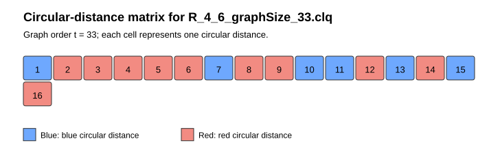

# Circulant Ramsey numbers

These graph certificates prove lower bounds for the circulant Ramsey numbers
$R_C(m,n)$ — the smallest graph order at which no circulant $(m,n)$-coloring
exists — reported in the paper's *Computational Study on Circulant Ramsey
Numbers* section, for $m=3,4,5$. Each certificate proves only the
lower-bound side $R_C(m,n)\ge N+1$; it is not a certificate for the matching
upper bound. The exact value $R_C(m,n)=N+1$ is established in the paper by
additionally using our method to prove infeasibility at all larger relevant
orders, which is not independently certifiable in the same way. Eight of
these values ($R_C(3,n)$ for $n=13,\ldots,20$) are new; the rest reproduce,
with a fully reproducible computational procedure, values previously reported
without a description of the computational procedure used.

Click a filename to open the certificate, or a figure link to open its
circular-distance / adjacency matrix. See [`README.md`](README.md) for the
file naming convention, file format, and verification instructions shared by
all certificates in this directory.

### R(3,n)

| Instance | N | Certificate | Figures |
| --- | --- | --- | --- |
| R(3,7) | 21 | [R_3_7_graphSize_21.clq](certificates/R_3_7_graphSize_21.clq) | [distances](matrices/R_3_7_graphSize_21.png) · [adjacency](matrices/R_3_7_graphSize_21_adjacency.png) |
| R(3,8) | 26 | [R_3_8_graphSize_26.clq](certificates/R_3_8_graphSize_26.clq) | [distances](matrices/R_3_8_graphSize_26.png) · [adjacency](matrices/R_3_8_graphSize_26_adjacency.png) |
| R(3,9) | 35 | [R_3_9_graphSize_35.clq](certificates/R_3_9_graphSize_35.clq) | [distances](matrices/R_3_9_graphSize_35.png) · [adjacency](matrices/R_3_9_graphSize_35_adjacency.png) |
| R(3,10) | 38 | [R_3_10_graphSize_38.clq](certificates/R_3_10_graphSize_38.clq) | [distances](matrices/R_3_10_graphSize_38.png) · [adjacency](matrices/R_3_10_graphSize_38_adjacency.png) |
| R(3,11) | 45 | [R_3_11_graphSize_45.clq](certificates/R_3_11_graphSize_45.clq) | [distances](matrices/R_3_11_graphSize_45.png) · [adjacency](matrices/R_3_11_graphSize_45_adjacency.png) |
| R(3,12) | 48 | [R_3_12_graphSize_48.clq](certificates/R_3_12_graphSize_48.clq) | [distances](matrices/R_3_12_graphSize_48.png) · [adjacency](matrices/R_3_12_graphSize_48_adjacency.png) |
| R(3,13) | 57 | [R_3_13_graphSize_57.clq](certificates/R_3_13_graphSize_57.clq) | [distances](matrices/R_3_13_graphSize_57.png) · [adjacency](matrices/R_3_13_graphSize_57_adjacency.png) |
| R(3,14) | 63 | [R_3_14_graphSize_63.clq](certificates/R_3_14_graphSize_63.clq) | [distances](matrices/R_3_14_graphSize_63.png) · [adjacency](matrices/R_3_14_graphSize_63_adjacency.png) |
| R(3,15) | 72 | [R_3_15_graphSize_72.clq](certificates/R_3_15_graphSize_72.clq) | [distances](matrices/R_3_15_graphSize_72.png) · [adjacency](matrices/R_3_15_graphSize_72_adjacency.png) |
| R(3,16) | 78 | [R_3_16_graphSize_78.clq](certificates/R_3_16_graphSize_78.clq) | [distances](matrices/R_3_16_graphSize_78.png) · [adjacency](matrices/R_3_16_graphSize_78_adjacency.png) |
| R(3,17) | 91 | [R_3_17_graphSize_91.clq](certificates/R_3_17_graphSize_91.clq) | [distances](matrices/R_3_17_graphSize_91.png) · [adjacency](matrices/R_3_17_graphSize_91_adjacency.png) |
| R(3,18) | 97 | [R_3_18_graphSize_97.clq](certificates/R_3_18_graphSize_97.clq) | [distances](matrices/R_3_18_graphSize_97.png) · [adjacency](matrices/R_3_18_graphSize_97_adjacency.png) |
| R(3,19) | 105 | [R_3_19_graphSize_105.clq](certificates/R_3_19_graphSize_105.clq) | [distances](matrices/R_3_19_graphSize_105.png) · [adjacency](matrices/R_3_19_graphSize_105_adjacency.png) |
| R(3,20) | 110 | [R_3_20_graphSize_110.clq](certificates/R_3_20_graphSize_110.clq) | [distances](matrices/R_3_20_graphSize_110.png) · [adjacency](matrices/R_3_20_graphSize_110_adjacency.png) |

### R(4,n)

| Instance | N | Certificate | Figures |
| --- | --- | --- | --- |
| R(4,6) | 33 | [R_4_6_graphSize_33.clq](certificates/R_4_6_graphSize_33.clq) | [distances](matrices/R_4_6_graphSize_33.png) · [adjacency](matrices/R_4_6_graphSize_33_adjacency.png) |
| R(4,7) | 46 | [R_4_7_graphSize_46.clq](certificates/R_4_7_graphSize_46.clq) | [distances](matrices/R_4_7_graphSize_46.png) · [adjacency](matrices/R_4_7_graphSize_46_adjacency.png) |
| R(4,8) | 51 | [R_4_8_graphSize_51.clq](certificates/R_4_8_graphSize_51.clq) | [distances](matrices/R_4_8_graphSize_51.png) · [adjacency](matrices/R_4_8_graphSize_51_adjacency.png) |
| R(4,9) | 68 | [R_4_9_graphSize_68.clq](certificates/R_4_9_graphSize_68.clq) | [distances](matrices/R_4_9_graphSize_68.png) · [adjacency](matrices/R_4_9_graphSize_68_adjacency.png) |

### R(5,n)

| Instance | N | Certificate | Figures |
| --- | --- | --- | --- |
| R(5,5) | 41 | [R_5_5_graphSize_41.clq](certificates/R_5_5_graphSize_41.clq) | [distances](matrices/R_5_5_graphSize_41.png) · [adjacency](matrices/R_5_5_graphSize_41_adjacency.png) |
| R(5,6) | 56 | [R_5_6_graphSize_56.clq](certificates/R_5_6_graphSize_56.clq) | [distances](matrices/R_5_6_graphSize_56.png) · [adjacency](matrices/R_5_6_graphSize_56_adjacency.png) |

### Example

Circular-distance matrix for `R_4_6_graphSize_33.clq`, the certificate proving $R_C(4,6)\ge34$:

The graph has $N=33$ vertices, so there are $\lfloor 33/2\rfloor=16$ distance classes. Distances 1–6, 8, 9, 12–15 are red: every one of the 33 edges at each of these distances is a certificate edge, so they belong to the red graph, which must avoid $K_6$. Distances 7, 10, 11, and 16 are blue: none of their edges are in the certificate, so they belong to the blue graph, which must avoid $K_4$. Every class is entirely one colour, confirming the graph is circulant.
