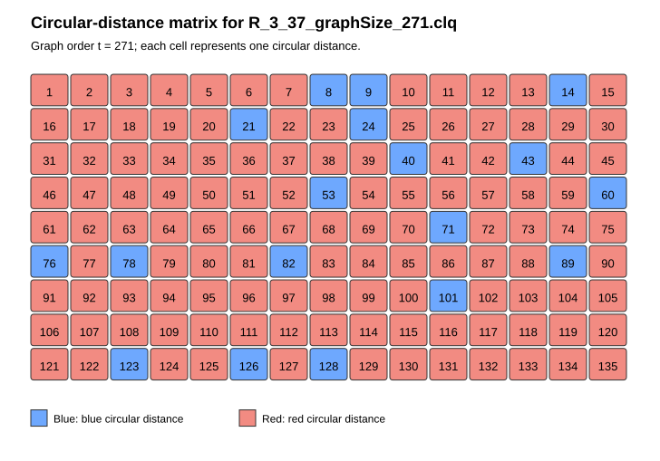

# Ramsey number lower bounds

These certificates prove new best lower bounds on the (unrestricted) Ramsey
numbers $R(3,n)$, for 25 values of $n$ with $24\le n\le49$ and $n\neq27$, as
reported in the paper's *Lower Bounds for Ramsey Numbers* section. Every
bound improves on the best value previously obtained by other methods.

Click a filename to open the certificate, or a figure link to open its
circular-distance / adjacency matrix. See [`README.md`](README.md) for the
file naming convention, file format, and verification instructions shared by
all certificates in this directory.

| Instance | N | Certificate | Figures |
| --- | --- | --- | --- |
| R(3,24) | 150 | [R_3_24_graphSize_150.clq](certificates/R_3_24_graphSize_150.clq) | [distances](matrices/R_3_24_graphSize_150.png) · [adjacency](matrices/R_3_24_graphSize_150_adjacency.png) |
| R(3,25) | 159 | [R_3_25_graphSize_159.clq](certificates/R_3_25_graphSize_159.clq) | [distances](matrices/R_3_25_graphSize_159.png) · [adjacency](matrices/R_3_25_graphSize_159_adjacency.png) |
| R(3,26) | 162 | [R_3_26_graphSize_162.clq](certificates/R_3_26_graphSize_162.clq) | [distances](matrices/R_3_26_graphSize_162.png) · [adjacency](matrices/R_3_26_graphSize_162_adjacency.png) |
| R(3,28) | 180 | [R_3_28_graphSize_180.clq](certificates/R_3_28_graphSize_180.clq) | [distances](matrices/R_3_28_graphSize_180.png) · [adjacency](matrices/R_3_28_graphSize_180_adjacency.png) |
| R(3,29) | 193 | [R_3_29_graphSize_193.clq](certificates/R_3_29_graphSize_193.clq) | [distances](matrices/R_3_29_graphSize_193.png) · [adjacency](matrices/R_3_29_graphSize_193_adjacency.png) |
| R(3,30) | 198 | [R_3_30_graphSize_198.clq](certificates/R_3_30_graphSize_198.clq) | [distances](matrices/R_3_30_graphSize_198.png) · [adjacency](matrices/R_3_30_graphSize_198_adjacency.png) |
| R(3,31) | 209 | [R_3_31_graphSize_209.clq](certificates/R_3_31_graphSize_209.clq) | [distances](matrices/R_3_31_graphSize_209.png) · [adjacency](matrices/R_3_31_graphSize_209_adjacency.png) |
| R(3,32) | 218 | [R_3_32_graphSize_218.clq](certificates/R_3_32_graphSize_218.clq) | [distances](matrices/R_3_32_graphSize_218.png) · [adjacency](matrices/R_3_32_graphSize_218_adjacency.png) |
| R(3,33) | 229 | [R_3_33_graphSize_229.clq](certificates/R_3_33_graphSize_229.clq) | [distances](matrices/R_3_33_graphSize_229.png) · [adjacency](matrices/R_3_33_graphSize_229_adjacency.png) |
| R(3,34) | 238 | [R_3_34_graphSize_238.clq](certificates/R_3_34_graphSize_238.clq) | [distances](matrices/R_3_34_graphSize_238.png) · [adjacency](matrices/R_3_34_graphSize_238_adjacency.png) |
| R(3,35) | 252 | [R_3_35_graphSize_252.clq](certificates/R_3_35_graphSize_252.clq) | [distances](matrices/R_3_35_graphSize_252.png) · [adjacency](matrices/R_3_35_graphSize_252_adjacency.png) |
| R(3,36) | 260 | [R_3_36_graphSize_260.clq](certificates/R_3_36_graphSize_260.clq) | [distances](matrices/R_3_36_graphSize_260.png) · [adjacency](matrices/R_3_36_graphSize_260_adjacency.png) |
| R(3,37) | 271 | [R_3_37_graphSize_271.clq](certificates/R_3_37_graphSize_271.clq) | [distances](matrices/R_3_37_graphSize_271.png) · [adjacency](matrices/R_3_37_graphSize_271_adjacency.png) |
| R(3,38) | 280 | [R_3_38_graphSize_280.clq](certificates/R_3_38_graphSize_280.clq) | [distances](matrices/R_3_38_graphSize_280.png) · [adjacency](matrices/R_3_38_graphSize_280_adjacency.png) |
| R(3,39) | 293 | [R_3_39_graphSize_293.clq](certificates/R_3_39_graphSize_293.clq) | [distances](matrices/R_3_39_graphSize_293.png) · [adjacency](matrices/R_3_39_graphSize_293_adjacency.png) |
| R(3,40) | 304 | [R_3_40_graphSize_304.clq](certificates/R_3_40_graphSize_304.clq) | [distances](matrices/R_3_40_graphSize_304.png) · [adjacency](matrices/R_3_40_graphSize_304_adjacency.png) |
| R(3,41) | 316 | [R_3_41_graphSize_316.clq](certificates/R_3_41_graphSize_316.clq) | [distances](matrices/R_3_41_graphSize_316.png) · [adjacency](matrices/R_3_41_graphSize_316_adjacency.png) |
| R(3,42) | 326 | [R_3_42_graphSize_326.clq](certificates/R_3_42_graphSize_326.clq) | [distances](matrices/R_3_42_graphSize_326.png) · [adjacency](matrices/R_3_42_graphSize_326_adjacency.png) |
| R(3,43) | 339 | [R_3_43_graphSize_339.clq](certificates/R_3_43_graphSize_339.clq) | [distances](matrices/R_3_43_graphSize_339.png) · [adjacency](matrices/R_3_43_graphSize_339_adjacency.png) |
| R(3,44) | 347 | [R_3_44_graphSize_347.clq](certificates/R_3_44_graphSize_347.clq) | [distances](matrices/R_3_44_graphSize_347.png) · [adjacency](matrices/R_3_44_graphSize_347_adjacency.png) |
| R(3,45) | 363 | [R_3_45_graphSize_363.clq](certificates/R_3_45_graphSize_363.clq) | [distances](matrices/R_3_45_graphSize_363.png) · [adjacency](matrices/R_3_45_graphSize_363_adjacency.png) |
| R(3,46) | 370 | [R_3_46_graphSize_370.clq](certificates/R_3_46_graphSize_370.clq) | [distances](matrices/R_3_46_graphSize_370.png) · [adjacency](matrices/R_3_46_graphSize_370_adjacency.png) |
| R(3,47) | 384 | [R_3_47_graphSize_384.clq](certificates/R_3_47_graphSize_384.clq) | [distances](matrices/R_3_47_graphSize_384.png) · [adjacency](matrices/R_3_47_graphSize_384_adjacency.png) |
| R(3,48) | 390 | [R_3_48_graphSize_390.clq](certificates/R_3_48_graphSize_390.clq) | [distances](matrices/R_3_48_graphSize_390.png) · [adjacency](matrices/R_3_48_graphSize_390_adjacency.png) |
| R(3,49) | 410 | [R_3_49_graphSize_410.clq](certificates/R_3_49_graphSize_410.clq) | [distances](matrices/R_3_49_graphSize_410.png) · [adjacency](matrices/R_3_49_graphSize_410_adjacency.png) |

### Example

Circular-distance matrix for `R_3_37_graphSize_271.clq`, the certificate proving $R(3,37)\ge272$:

The graph has $N=271$ vertices, so there are $\lfloor 271/2\rfloor=135$ distance classes, shown left to right, top to bottom. Distances 1–7 are red: every one of the 271 edges at each of these distances is a certificate edge, so they belong to the red graph, which must avoid $K_{37}$. Distances 8 and 9 are blue: none of their 271 edges are in the certificate, so they belong to the blue graph, which must avoid $K_3$ (be triangle-free). Overall, 117 of the 135 distances are red and 18 are blue; every class is entirely one colour, confirming the graph is circulant.
